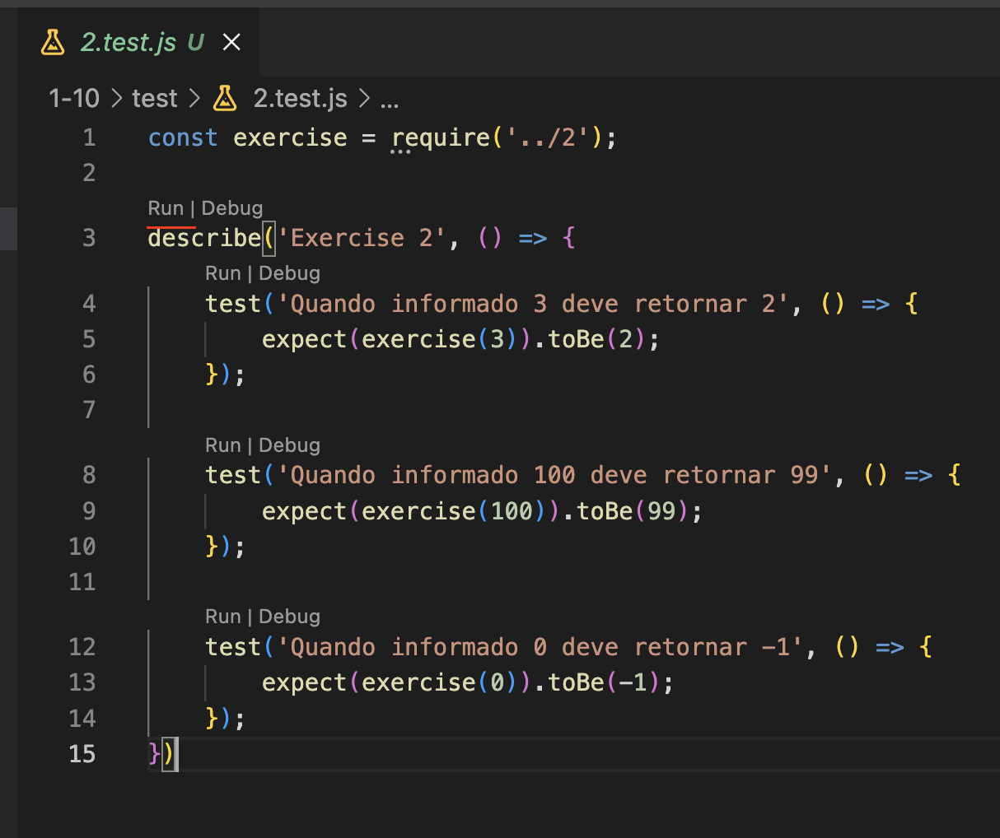

# Exercícios Javascript

Esse repositório é apenas um conjunto de exercícios criados em javascript para treinar os conceitos básicos de lógica de programação.

Os exercícios estão dividos por nível e separados em pastas para maior facilidade na hora da resolução.

## Requirements

- Node.js

## Getting started

`git clone https://github.com/PeterPimentel/js-exercises.git`

`npm install`

Para facilitar validar a resolução dos testes recomendo a utilização da extensão Jest Runner

## Validating the responses

Para verificar a resolução das questões existem duas maneiras, via linha de comando ou através da extensão do VS Code.

### Linha de comando

Para verificar a resolução basta correr o comando de teste relativo ao folder dos exercícios Ex: `npm run test-1-10`

### Extensão (Recomendado)

Se utilizando a extensão ir a pasta de `test`e no ficheiro do respectivo exercício carregar no botão `run`.

